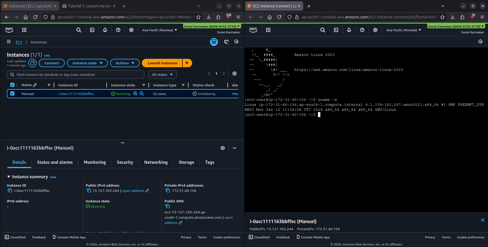
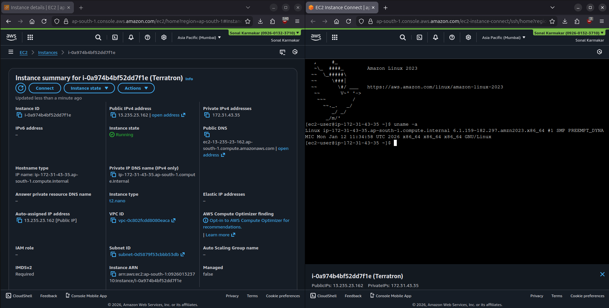
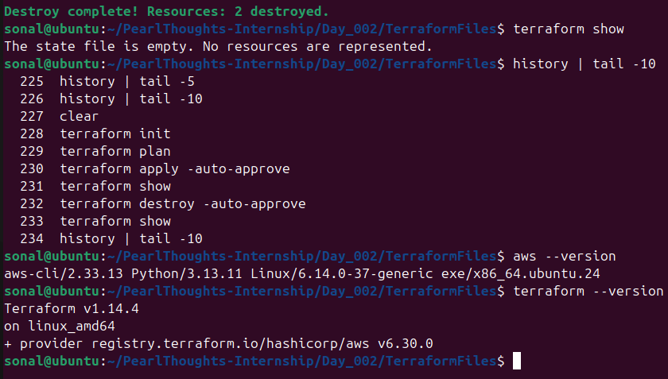

# Day 2 | Task 2    

## Task Details
1. Learn core concepts of AWS and Terraform.
2. Launch an AWS EC2 instance manually, and another provisioned using Terraform.
3. Document the entire process in a `.md` file.

## Documenting my understanding
Below are the links to documentation of what I have understood about AWS and Terraform
- [AWS Documentation](./AWS.md)
- [Terraform Documentation](./Terraform.md)

## EC2 Instance using AWS Management Console
Followed the tutorial in the official AWS documentation, as linked below--
- [Tutorial 1: Launch my very first Amazon EC2 instance](https://docs.aws.amazon.com/AWSEC2/latest/UserGuide/tutorial-launch-my-first-ec2-instance.html)

Screenshot of successful EC2 instance creation

## EC2 Instance using Terraform
### Steps performed
- Installed Terraform as per [official documentation](https://developer.hashicorp.com/terraform/install).
- Installed AWS CLI as per [official documentation](https://docs.aws.amazon.com/cli/latest/userguide/getting-started-install.html).
- Made connection with AWS by creating [IAM User](https://docs.aws.amazon.com/IAM/latest/UserGuide/id_users_create.html) and [Access Key](https://docs.aws.amazon.com/IAM/latest/UserGuide/id_credentials_access-keys.html).
    - Ran the command "**`aws configure`**" and entered the details.
- Created Terraform configuration files by referring [AWS Instance documentation in Terraform Registry](https://registry.terraform.io/providers/hashicorp/aws/latest/docs/resources/instance).
    - [**`provider.tf`**](./TerraformFiles/provider.tf) contains provider definitions.
    - [**`main.tf`**](./TerraformFiles/main.tf) contains infrastructure definition of EC2 instance.
- Went through the 4 main stages of Terraform's flow of execution
    - _Initialise_: `terraform init`
    - _Plan_: `terraform plan`
    - _Apply_: `terraform apply` (used `-auto-approve` flag to approve all provisions)
    - _Destroy_: `terraform destroy` (used `-auto-approve` flag to delete all resources)
### Screenshots

## References
All references are linked where used. See my [AWS Documentation](./AWS.md) and [Terraform Documentation](./Terraform.md) for more references.
