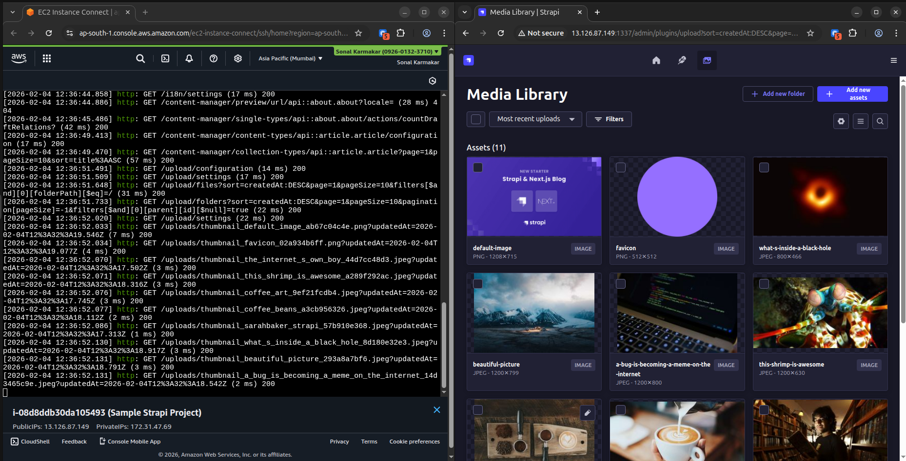
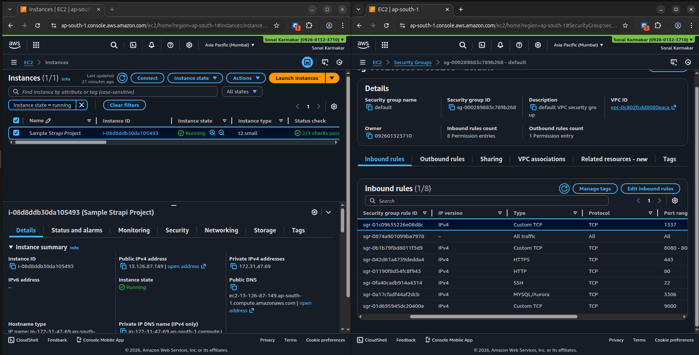
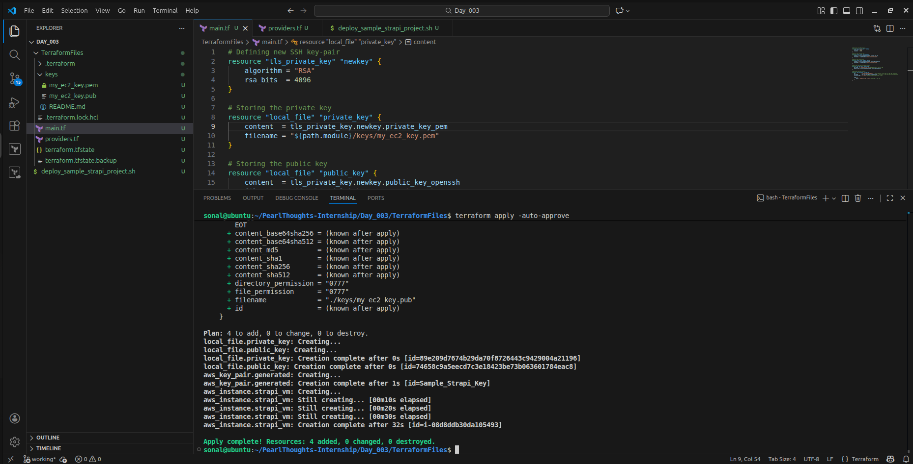

# Day 3 | Task 3
## Task Details
1. Provision an EC2 instance, and create a `.pem` file through Terraform and managed by Terraform.
2. Run Strapi in the EC2 instance and make a Loom video for all that process.
3. Use module structure for Terraform.
4. Create a Git repository and raise PR
## Steps of Completing the Task
### Prerequisites
- Have an AWS account with privileges for the following--
	- EC2 Instance creation and management.
	- Access Key generation.
- Install Terraform and AWS CLI and connect them to AWS.
### Creating AWS EC2 Instance
- ***Step 1***: Created the files in the [Terraform directory](./TerraformFiles/) for provisioning EC2 instance with Amazon Linux.
- ***Step 2***: Login to EC2 instance using SSH and installed NodeJS as per [official AWS Documentation](https://docs.aws.amazon.com/sdk-for-javascript/v2/developer-guide/setting-up-node-on-ec2-instance.html).
- ***Step 3***: Created a [Bash script](./deploy_sample_strapi_project.sh) to deploy the Strapi project.
### Deliverables
- [GitHub PR](https://github.com/sonalkarmakar/PearlThoughts-Internship/pull/3#issue-3896488516)
- [Loom Video](https://www.loom.com/share/206736fcd1a14121a3259234e89f67ff)
- Screenshots (see below)
#### Screenshots
- Strapi Admin Panel Running
	
- AWS EC2 Configuration
	
- Terraform Code
	
### Problems
- I couldn't login to EC2 Instances from my machine using SSH. So, I logged in from Console for deploying the project.
## References
- [Install NodeJS in Amazon Linux]([official AWS Documentation](https://docs.aws.amazon.com/sdk-for-javascript/v2/developer-guide/setting-up-node-on-ec2-instance.html))
- [Stack Overflow | How to create an SSH key in Terraform?](https://stackoverflow.com/questions/49743220/how-to-create-an-ssh-key-in-terraform)
- [Terraform Registry | AWS Provider Documentation | EC2 Instance](https://registry.terraform.io/providers/hashicorp/aws/latest/docs/resources/instance)
- [Terraform Registry | AWS Provider Documentation | Key Pair](https://registry.terraform.io/providers/hashicorp/aws/latest/docs/resources/key_pair)
