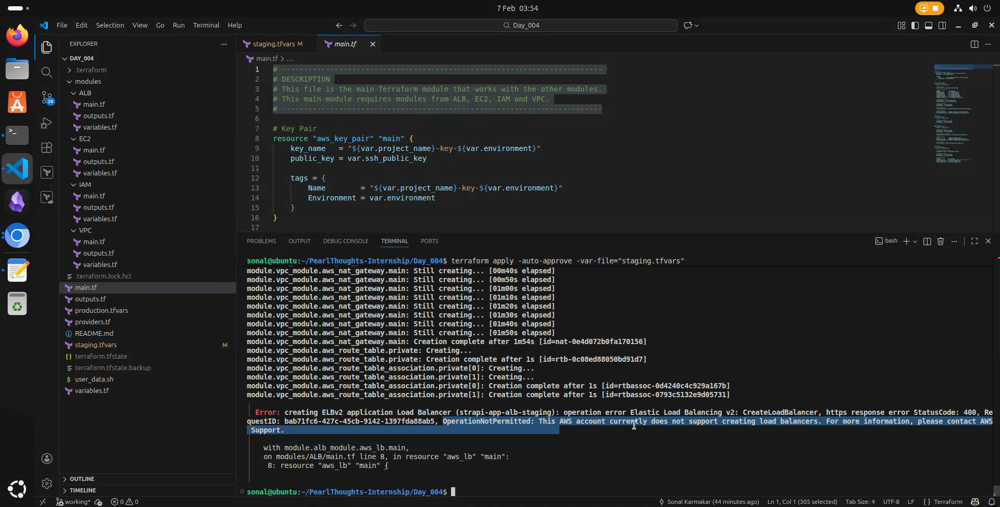

# Day 4 & 5 | Task 4
## Task Details
Design modular Terraform code to deploy the following:
1. A private EC2 instance in a VPC using public/private subnets.
2. A NAT Gateway for outbound internet, security groups for access control, and key pair for login.
3. Use `user_data` to auto-install Docker and run a sample Strapi project, with all environment differences managed via `tfvars`. 
4. You can have load balancer in public subnet to access the application.

---
## Steps to Deploy
### Prerequisites
- [Install Terraform](https://developer.hashicorp.com/terraform/install).
- [Install AWS CLI](https://docs.aws.amazon.com/cli/latest/userguide/getting-started-install.html).
- Prepare an AWS account with appropriate privileges for EC2 and VPC.
- [Create Access Keys](https://docs.aws.amazon.com/IAM/latest/UserGuide/access-key-self-managed.html) with the AWS account.
- Strapi API keys.
- New SSH key-pair.

### Executing Terraform
- **<ins>Step 1</ins>:** Enter the appropriate values as per your environment/setup inside [`production.tfvars`](./production.tfvars) or [`stagin.tfvars`](./staging.tfvars). **_SSH Public Key is required_ to be put inside the `.tfvars` files**.
- **<ins>Step 2</ins>:** Open a terminal and go inside the Terraform project directory.
- **<ins>Step 3</ins>:** Execute the Terraform commands as needed--
    - Initiate Terraform
        ```sh
        terraform init
        ```
    - Validate code syntax if any changes were made
        ```sh
        terraform validate
        ```
    - Plan infrastructure
        > [!NOTE]
        >
        > 1. Use the **`-out=/path/to/file`** flag to save the plan to a file.
        > 2. **Not using the `-var-file=/path/to/file`** will make Terraform prompt you for input, because `terraform.tfvars` file is absent.
        ```sh
        terraform plan -var-file="production.tfvars"
        ```
        Or,
        ```sh
        terraform plan -var-file="staging.tfvars"
        ```
    - Apply the planned infrastructure
        > [!NOTE]
        > 
        > 1. Use the **`-auto-approve`** flag to automatically approve all deployments.
        > 2. **Not using the `-var-file=/path/to/file`** will make Terraform prompt you for input, because `terraform.tfvars` file is absent.
        ```sh
        terraform apply -var-file="production.tfvars"
        ```
        Or,
        ```sh
        terraform apply -var-file="staging.tfvars"
        ```
    - Show current infrastructure state
        ```sh
        terraform show
        ```
    - Destroy the infrastructure
        > [!NOTE]  
        > 
        > Use the **`-auto-approve`** flag to automatically approve all deployments, else you have to manually approve their destrcution.
        ```sh
        terraform destroy -auto-approve -var-file="production.tfvars" # will destroy all 
        ```

---
## Problems
The execution was incomplete for me because the Application Load Balancer was not created, as my account doesn't seem to be authorised to do that.

This might be because of AWS account age, but this is also a known issue for multiple AWS accounts.

---
## Deliverables
### Links
- [Loom video](https://www.loom.com/share/c3a93f100b1a49a898948c0400e72518)
- [GitHub repository (this directory here)](https://github.com/sonalkarmakar/PearlThoughts-Internship/tree/main/Day_004)

### Screenshots
- Terraform exectuion completed
    
- VPC setup diagram
    

## References
- [Deploy an EC2 instance inside a custom VPC using Terraform](https://dev.to/uwadon1/deploy-an-ec2-instance-inside-a-custom-vpc-using-terraform-26e9).
- [Provisioning a Network Load Balancer with Terraform](https://hceris.com/provisioning-a-network-load-balancer-with-terraform/).
- [Terraform Registry | AWS Provider Documentation | `aws_lb`](https://registry.terraform.io/providers/hashicorp/aws/latest/docs/resources/lb).
- [Build AWS EC2 Instances, Security Groups using Terraform](https://terraformguru.com/terraform-real-world-on-aws-ec2/07-AWS-EC2Instance-and-SecurityGroups/).
- [Quickstart: Create a public load balancer to load balance VMs using Terraform](https://learn.microsoft.com/en-us/azure/load-balancer/quickstart-load-balancer-standard-public-terraform).
- [Building AWS VPC and EC2 Infrastructure with Terraform: A Hands-On DevOps Tutorial](https://aws.plainenglish.io/building-aws-vpc-and-ec2-infrastructure-with-terraform-a-hands-on-devops-tutorial-4955eac76f4f).
- [Placing EC2 Webserver Instances in a Private Subnet with Internet Access via NAT Gateway using Terraform](https://dev.to/chinmay13/placing-ec2-webserver-instances-in-a-private-subnet-with-internet-access-via-nat-gateway-using-terraform-167n).
